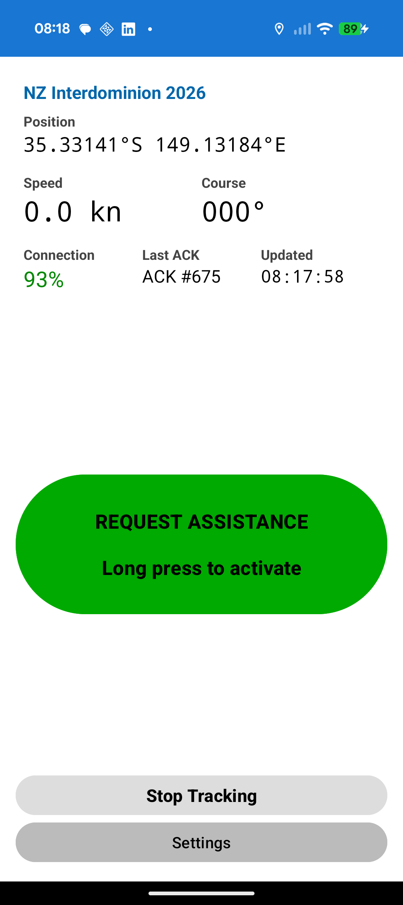
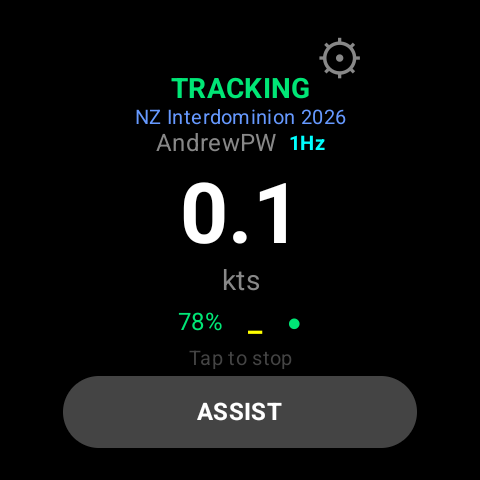
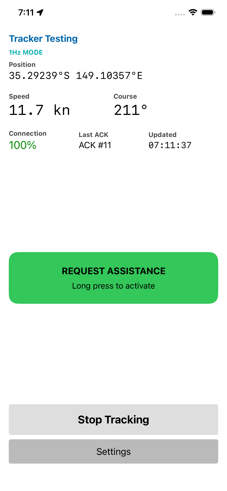
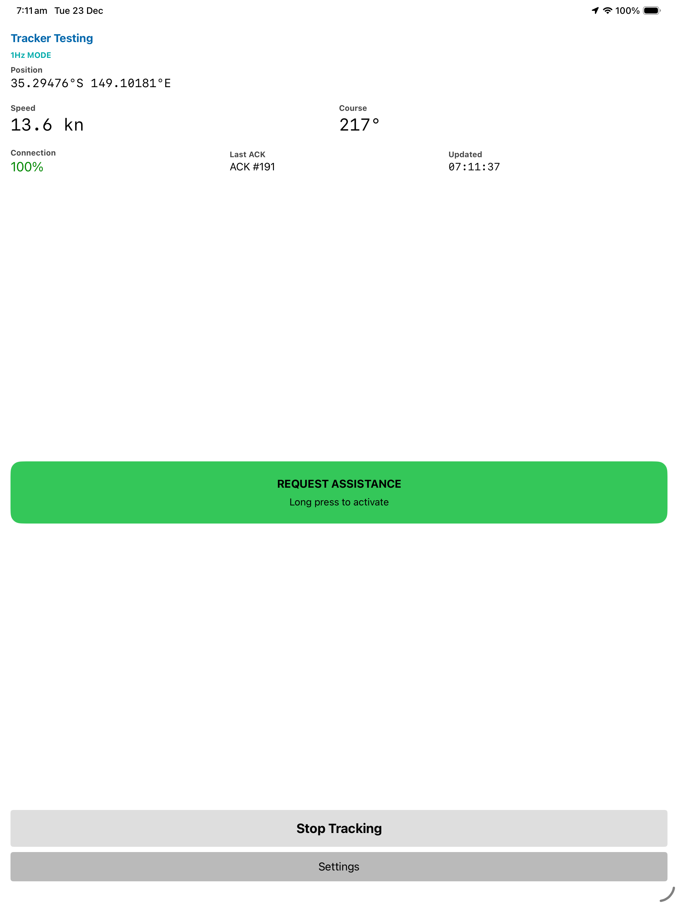
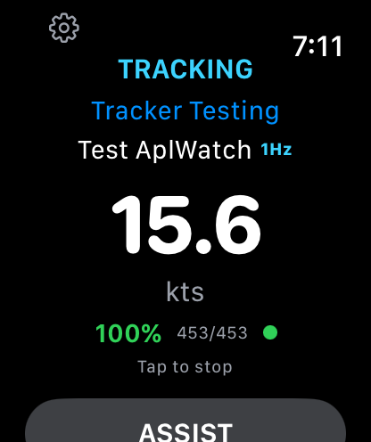

# Windsurfer Tracker

A GPS tracking system for windsurfing races using UDP for maximum reliability on poor mobile connections, with a web-based map UI for race organizers.

**Live demo:** [wstracker.org](https://wstracker.org)

## Features

- **Multi-event support** - Host multiple races/regattas with separate data, passwords, and courses
- **Real-time GPS tracking** - Position updates every 10 seconds from Android, iOS, and smartwatch devices
- **1Hz high-frequency mode** - Optional 1-second position updates for detailed track analysis
- **Multiple roles** - Track sailors (windsurfers), support boats, and spectators with distinct icons
- **Emergency assist** - One-touch "Request Assist" button with audio alerts in the web UI
- **Track history** - View historical tracks for each participant with incremental loading
- **Track review** - Detailed analysis page with speed, battery, signal, and latency graphs
- **Course management** - Draw, save, and display race courses with start, marks, and finish
- **Course distance** - Automatic calculation and display of course length in km
- **Reliable protocol** - UDP with acknowledgements, designed for unreliable mobile connections
- **Battery & signal monitoring** - Track device battery level and signal strength
- **Daily log rotation** - Automatic daily log files in JSONL format with midnight auto-clear per timezone
- **Admin controls** - Password-protected admin panel for course and track management
- **Event management** - Web UI for creating and managing events

## Apps

### Android Phone



Native Kotlin app for Android phones:
- Tracks GPS position every 10 seconds
- Sends UDP packets with position, speed, heading, battery, signal strength
- Supports multiple roles: sailor, support, spectator
- Event selection from available events on server
- Displays connection status (ACK rate)
- Large "Request Assist" button for emergencies

**Build:**
```bash
cd android
./gradlew assembleDebug
# APK: app/build/outputs/apk/sideload/debug/
```

### Wear OS (Samsung Galaxy Watch, Pixel Watch)



Native Kotlin app for Wear OS smartwatches:
- Standalone tracking (no phone required with LTE watches)
- Heart rate monitoring during tracking
- Compact UI optimized for small screens
- Works with Galaxy Watch 4+, Pixel Watch, and other Wear OS 3+ watches

**Build:**
```bash
cd wear
./gradlew assembleDebug
# APK: app/build/outputs/apk/debug/
```

### iPhone



Native Swift app for iPhone:
- Same functionality as the Android app
- Event selection from available events on server
- Available via TestFlight (App Store release planned)
- Background location tracking with iOS location indicator

**Build:**
```bash
cd swift/WindsurferTracker
xcodegen generate
xcodebuild build -scheme WindsurferTracker -destination 'generic/platform=iOS'
```

### iPad



The iPhone app runs on iPad with full support for larger screens.

### Apple Watch



Native Swift app for Apple Watch:
- Standalone tracking (no iPhone required with cellular watches)
- Workout session integration for reliable background tracking
- Compact UI with large speed display
- Works with Apple Watch Series 3+ (watchOS 8.0+)

The Apple Watch app is bundled with the iPhone app and installed via the Watch app on your paired iPhone after installing from TestFlight.

## Components

### Server (`server/tracker_server.py`)

Python UDP/HTTP server that:
- Manages multiple events with separate data and passwords
- Receives position reports on UDP port 41234
- Sends acknowledgements back to clients
- Writes per-event `current_positions.json` for the web UI (atomic writes)
- Maintains daily track logs per event in `{eid}/logs/YYYY_MM_DD.jsonl` format
- Automatically clears tracks at midnight in each event's configured timezone
- Serves static files (Web UI) and provides admin/management API endpoints

### Web UI (`WebUI/`)

Event-based web interface:
- **index.html** - Event picker showing available events
- **event.html** - Live tracking map for a specific event
- **manage.html** - Event management for creating/editing events
- **review.html** - Post-race track analysis

The tracking map (`event.html`):
- Polls per-event `current_positions.json` every 3 seconds
- Displays different icons per role (windsurfer, powerboat, binoculars)
- Shows track history from daily log files using Range requests
- Admin panel for course management and track clearing
- Plays audio alerts when assist is requested
- Shows course length in the legend

### Track Review (`WebUI/review.html`)

Post-race analysis page that:
- Loads track data from daily log files
- Displays interactive graphs (speed, battery, signal, latency)
- Time range slider to focus on specific portions of the track
- Outlier filtering to remove GPS glitches
- Speed-based track coloring (green→yellow→red)
- Click on graphs to highlight corresponding position on map
- Drag to resize graphs

## Installation

### Prerequisites

- Python 3.8+ (for server)
- Android Studio or Gradle (for building Android/Wear OS apps)
- Xcode 15+ and XcodeGen (for building iOS/watchOS apps)

### Server Setup

```bash
# Clone the repository
git clone <repository-url>
cd windsurfer-tracker

# Create settings.json for configuration
cat > server/settings.json << EOF
{
  "manager_password": "your_manager_password",
  "static_dir": "../WebUI",
  "events_file": "events.json"
}
EOF

# Start server (serves Web UI on same port)
cd server
python3 tracker_server.py

# Or with custom port
python3 tracker_server.py --port 8080
```

The server will be available at `http://localhost:41234`

On first run, create your first event via the web UI at `/manage.html` or by creating `events.json` manually.

### Server Options

The server reads configuration from `settings.json` (recommended) or command line arguments:

**settings.json fields:**
| Field | Description |
|-------|-------------|
| `manager_password` | Password for event management API |
| `static_dir` | Directory to serve static files (Web UI) |
| `events_file` | Path to events.json file |

**Command line options:**
| Option | Default | Description |
|--------|---------|-------------|
| `-p, --port` | 41234 | UDP/HTTP port to listen on |
| `--http-port` | (same as UDP) | Separate HTTP port if needed |
| `--settings` | settings.json | Path to settings file |
| `--no-http` | | Disable HTTP server |
| `--no-track-logs` | | Disable daily track logging |
| `--no-current` | | Disable current positions file |

### Android App Build

```bash
cd android
./gradlew assembleDebug
# APK will be in app/build/outputs/apk/sideload/debug/
```

Or using Android Studio:
1. Open the `android/` folder as a project
2. Build → Build Bundle(s)/APK(s) → Build APK(s)

### Wear OS App Build

```bash
cd wear
./gradlew assembleDebug
# APK will be in app/build/outputs/apk/debug/
```

### iOS/watchOS App Build

```bash
# Install XcodeGen if needed
brew install xcodegen

cd swift/WindsurferTracker
xcodegen generate
open WindsurferTracker.xcodeproj
# Build and run from Xcode
```

The watchOS app is automatically built as part of the iOS app and embedded in the iPhone app bundle.

### Install APK to Device

```bash
# Android phone
adb install android/app/build/outputs/apk/sideload/debug/app-sideload-debug.apk

# Wear OS watch
adb install wear/app/build/outputs/apk/debug/app-debug.apk
```

### iOS/watchOS Distribution

The iOS and watchOS apps are distributed via TestFlight. For end users, see the installation instructions at `WebUI/install/`.

## Testing

Use the included test client to simulate multiple participants:

```bash
# Simulate 5 sailors, 1 support boat, 2 spectators for event 1
python3 server/test_client.py -H localhost --eid 1 --num-sailors 5 --num-support 1 --num-spectators 2

# Test assist flag for specific sailor
python3 server/test_client.py -H localhost --eid 1 --assist S03

# Custom location (Auckland area)
python3 server/test_client.py -H localhost --eid 1 --start-loc "-36.85,174.76" --end-loc "-36.84,174.77"

# Faster updates for testing
python3 server/test_client.py -H localhost --eid 1 --delay 2
```

### Test Client Options

| Option | Default | Description |
|--------|---------|-------------|
| `-H, --host` | 127.0.0.1 | Server hostname |
| `-p, --port` | 41234 | Server port |
| `--eid` | 1 | Event ID to send packets to |
| `--num-sailors` | 5 | Number of sailors to simulate |
| `--num-support` | 1 | Number of support boats |
| `--num-spectators` | 2 | Number of spectators |
| `--start-loc` | -36.8485,174.7633 | Start location (lat,lon) |
| `--end-loc` | -36.8385,174.7733 | End location (lat,lon) |
| `-d, --delay` | 10.0 | Seconds between position reports |
| `--duration` | 0 | Duration in seconds (0 = forever) |
| `--assist` | | Entity ID to set assist flag |
| `-v, --verbose` | | Verbose output |

## Track Review

Access the track review page at `/review.html` on your server. Select your event, then use the post-race analysis tools:

### Usage

1. Select a date from the dropdown (defaults to today)
2. Check users to display their tracks
3. Use the time slider to focus on a specific time range
4. Enable graphs from the Graphs dropdown (Speed, Battery, Signal, Latency)

### Options

- **Color by speed** - Color track segments from green (slow) to red (fast)
- **Show pos markers** - Display markers at each logged position
- **Filter outliers** - Remove GPS glitches based on speed threshold
- **Show outliers** - Display filtered points as red markers

### Graph Interaction

- Click on a graph to highlight the corresponding position on the map
- Drag the bottom edge of a graph panel to resize it
- Graphs automatically rescale based on the selected time range

### Latency Graph

The latency graph shows network delay (time from GPS fix to server receipt). High latency spikes often indicate:
- Android Doze mode (battery optimization when screen is off)
- Poor mobile network coverage
- Network congestion

## User Overrides

Admins can customize display names and roles for any tracker client via the Web UI. Each event has its own set of user overrides.

### Via Web UI

1. Select your event from the main page
2. Enter Admin mode (click Admin button, enter event admin password)
3. Click on any tracker marker on the map
4. Click the "Edit" button in the popup
5. Set a display name and/or override the role
6. Click Save

### API Endpoints

- `GET /api/event/{eid}/users` - List all user overrides (requires admin auth)
- `POST /api/event/{eid}/admin/user/{id}` - Set override for a user (requires admin auth)
- `DELETE /api/event/{eid}/admin/user/{id}` - Remove override for a user (requires admin auth)

Overrides are stored per-event in `html/{eid}/users.json`.

## JSON Packet Format

### Position Report (Phone → Server)

```json
{
  "id": "S07",
  "eid": 1,
  "sq": 12345,
  "ts": 1732615200,
  "lat": -36.8485,
  "lon": 174.7633,
  "spd": 12.5,
  "hdg": 275,
  "ast": false,
  "bat": 85,
  "sig": 3,
  "role": "sailor",
  "hr": 120
}
```

| Field | Type | Description |
|-------|------|-------------|
| `id` | string | Participant identifier (e.g., "S07") |
| `eid` | int | Event ID (defaults to 1 if not specified) |
| `sq` | int | Sequence number for ACK matching |
| `ts` | int | Unix timestamp (seconds) |
| `lat` | float | Latitude in decimal degrees |
| `lon` | float | Longitude in decimal degrees |
| `spd` | float | Speed in knots |
| `hdg` | int | Heading in degrees (0-360) |
| `ast` | bool | Assist requested flag |
| `bat` | int | Battery percentage (0-100, -1 if unknown) |
| `sig` | int | Signal strength (0-4, -1 if unknown) |
| `role` | string | Role: "sailor", "support", or "spectator" |
| `hr` | int | Heart rate in BPM (optional, from smartwatches) |

### Acknowledgement (Server → Phone)

```json
{
  "ack": 12345,
  "ts": 1732615201
}
```

| Field | Type | Description |
|-------|------|-------------|
| `ack` | int | Sequence number being acknowledged |
| `ts` | int | Server receive timestamp |

## API Endpoints

### Event Management (requires X-Manager-Password header)

- `GET /api/events` - List all events (public, no auth)
- `GET /api/manage/events` - List all events with passwords
- `POST /api/manage/event` - Create new event
- `PATCH /api/manage/event/{eid}` - Update event
- `DELETE /api/manage/event/{eid}` - Archive/delete event

### Per-Event Public

- `GET /api/event/{eid}/course` - Get course data for event

### Per-Event Admin (requires X-Admin-Password header)

- `GET /api/event/{eid}/auth/check` - Check admin authentication
- `POST /api/event/{eid}/admin/clear-tracks` - Clear today's track logs
- `POST /api/event/{eid}/admin/course` - Save course data
- `DELETE /api/event/{eid}/admin/course` - Delete course
- `GET /api/event/{eid}/users` - Get user overrides
- `POST /api/event/{eid}/admin/user/{id}` - Set user override
- `DELETE /api/event/{eid}/admin/user/{id}` - Remove user override

## Network Requirements

- Server needs a static public IP or port forwarding on UDP port 41234
- HTTP can be served on the same port or a different one
- Phones need mobile data (LTE/5G) - designed for unreliable connections
- Protocol optimizations:
  - Small packets (~100-150 bytes)
  - Multiple transmission attempts with ACK
  - UDP for minimal connection overhead

## File Structure

```
windsurfer-tracker/
├── server/
│   ├── tracker_server.py    # Main UDP/HTTP server
│   ├── test_client.py       # Test client simulator
│   ├── settings.json        # Server configuration
│   └── events.json          # Event definitions (passwords)
├── android/                  # Android phone app (Kotlin)
├── wear/                     # Wear OS smartwatch app (Kotlin)
├── swift/                    # iOS/watchOS apps (Swift)
│   └── WindsurferTracker/
├── WebUI/
│   ├── index.html           # Event picker
│   ├── event.html           # Live tracking map UI
│   ├── manage.html          # Event management UI
│   ├── review.html          # Post-race track review
│   └── install/             # Installation guides
├── store/                    # App store assets
│   └── screenshots/         # App screenshots
└── html/                     # Per-event data (created at runtime)
    ├── 1/                    # Event ID 1
    │   ├── logs/             # Daily track logs
    │   ├── current_positions.json
    │   ├── course.json
    │   └── users.json
    └── 2/                    # Event ID 2
        └── ...
```

## License

This project is licensed under the [GNU General Public License v3.0](LICENSE) (GPLv3+).

## Acknowledgments

This project uses the following third-party resources:

- **[Leaflet](https://leafletjs.com/)** - Open-source JavaScript library for interactive maps (BSD-2-Clause license)
- **[OpenStreetMap](https://www.openstreetmap.org/)** - Map data © OpenStreetMap contributors (ODbL license)
- **Windsurfer logo** - The app icon is based on the Windsurfer class logo, thanks to Windsurfing International
- **[OwnTracks](https://owntracks.org/)** - Thanks to the OwnTracks project for inspiration and ideas
